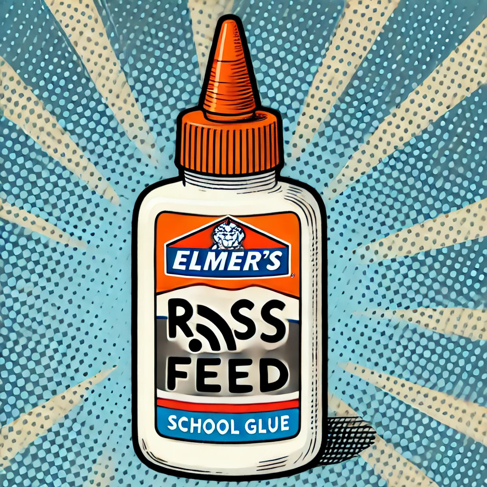

# RSS Glue

RSS Glue is a highly extensible, filesystem-based RSS/Atom feed generator and manipulator.

* Compose, merge, digest, and filter feeds.
* Take action on feed content (limited, this isnt an automation platform).
* Make your own feed pipelines with a little bit of Python.



RSS Glue functions as either a static generator and an on-demand feed server.

* `rss-glue watch` - **Static generator mode.** Watches your configuration and regenerates feeds on a schedule.
* `rss-glue debug` - **On-demand server mode.** Serves feeds and generates them on-demand when requested.

## Inputs and Outputs

External Data Sources

* `RssFeed` an external RSS Feed.
* `RedditFeed` because the standard Reddit RSS feed leaves out too much content and you can get more from the JSON api.
* `HackerNewsFeed` Hacker News stories (top, new, or best).
* `InstagramFeed` public Instagram profiles using ScrapeCreator.
* `FacebookFeed` public Facebook groups and pages using ScrapeCreator.

Meta Data Sources

* `MergeFeed` is a simple chronological merge of multiple feeds.
* `DigestFeed` is a periodical rollup of a feed, such as a daily digest.
* `AiFilterFeed` is a feed filtered by a prompt to some AI backend.
* `CacheFeed` is a wrapper that caches images from post content to avoid CORS issues and broken links.

Outputs

Your feeds generate the following outputs. Each source feed in the configuration file will generate a fixed set of output artifacts.

* `RssOutput` is an output RSS feed.
* `HTMLOutput` is a very basic single page web feed output.
* `HTMLIndexOutput` is a meta-output HTML page with a link to all its child outputs. Handy for quick reference and adding feeds to your RSS reader.
* `OpmlOutput` is a meta-output OPML file with links to all the RSS outputs for quick import into RSS readers.

## Quick Start

### Local Install (pip)

```bash
# Install RSS Glue
pip install rss-glue

# Create your configuration file and edit it
touch config.py

# Populate your feed
rss-glue --config config.py update

# Start a watcher process to regenerate files on schedule
rss-glue --config config.py watch

# Start a debug web server
rss-glue --config config.py debug

# Force regeneration of all files
rss-glue --config config.py generate --force

# Repair the timestamps on the disk database
# Rss glue depends on manipulating file modification times for caching.
# Editing files outside of rss-glue can break this.
rss-glue --config config.py repair
```

### Docker

RssGlue can be run with docker, and requires that its static files be served with a regular web server such as nginx or caddy.

```bash
# You can build the container yourself
docker buildx build -t rssglue .
```

There's a sample docker-compose to do this in [./docker-compose.yml](./docker-compose.yml).

```bash
docker compose up -d
```

### Deploying with GitHub Pages

Because this is more like a static site generator than a web service, you can deploy it without any of your own infrastructure using a continuous integration job that runs on a timer and push the files to any static server like S3, Google Cloud Buckets, Netlify, or GH Pages.

## Configuration

RSS Glue is configured entirely with Python. Here's an example.

```python
from rss_glue.feeds import DigestFeed, MergeFeed, RssFeed, CacheFeed
from rss_glue.outputs import HTMLIndexOutput, HtmlOutput, RssOutput
from rss_glue.resources import global_config

# An optional function to run after content has been generated
# def run_after_generate():
#     import subprocess
#     subprocess.run(["rsync", "/etc/rssglue/static", "/somewhere/else"])

# Start by calling the configure function
global_config.configure(
    # A root directory for the files RSS Glue will generate
    static_root="/etc/rssglue/static",
    # The base public URL to use for building reference links
    base_url="http://localhost:5000/static/",
    # (Optional) a function to run when files change
    # run_after_generate=run_after_generate,
)

# All times and schedules are in UTC
cron_weekly_on_sunday = "0 5 * * 0"

sources = [
    # A weekly digest of the F1 subreddit
    DigestFeed(
        RssFeed(
            "r_formula1_top_week", # A unique name for this feed.
            "https://www.reddit.com/r/formula1/top.rss?t=week",
            limit=20,
        )
        schedule=cron_weekly_on_sunday,
    ),
    # Cache images from a feed to avoid CORS and broken links
    CacheFeed(
        RssFeed(
            "my_feed",
            "https://example.com/feed.xml",
            limit=15,
        )
    ),
]
```

### Building your own feeds

This project is intended to be quite extensible. To build a new data source or feed transformer, just fork this project and write a new feed class.

```python
from rss_glue.feeds.base_feed import BaseFeed

class MyCustomFeed(BaseFeed):
    def __init__(self, namespace: str, some_parameter: str):
        super().__init__(namespace)
        self.some_parameter = some_parameter

    def update(self):
        for post in []:
            post_id = 'id'
            self.cache_set(post_id, value.to_dict())
        self.set_last_run()
```

## Design philosophy

RSS Glue is a simple python tool to manage feed generation and outputs exclusively to the local filesystem. The files it generates could be exposed with a web server, pushed up to an S3 bucket, or built into a netlify deployment. You don't need to operate a server or have some kind of docker host to run it.

It is not intended to scale beyond a few hundred feeds because, well, you're a human and you can't read all that anyway! It isn't intended to deploy as a multi-user app on the web. It will get a SPA app or a configuration language.

This project is a little like a tiny, feed-oriented version of [dagster](https://dagster.io/). Your feed definition will be a list of DAGs.  Each root feed will generate a predefined set of outputs.

**Compared with RSSHub**

RSSHub does not work very well. If it's meeting your needs, you probably don't need RSS Glue.

**Event-driven vs Polling**

RSS Glue is a polling-based system. It wakes up on a schedule, fetches feeds, generates outputs, and goes back to sleep. 
This is because some feeds can be expensive to fetch and process, and it's better to do that work outside the request thread of the downstream RSS consumer. It also makes it easier to trace problems because artifacts are statically generated.